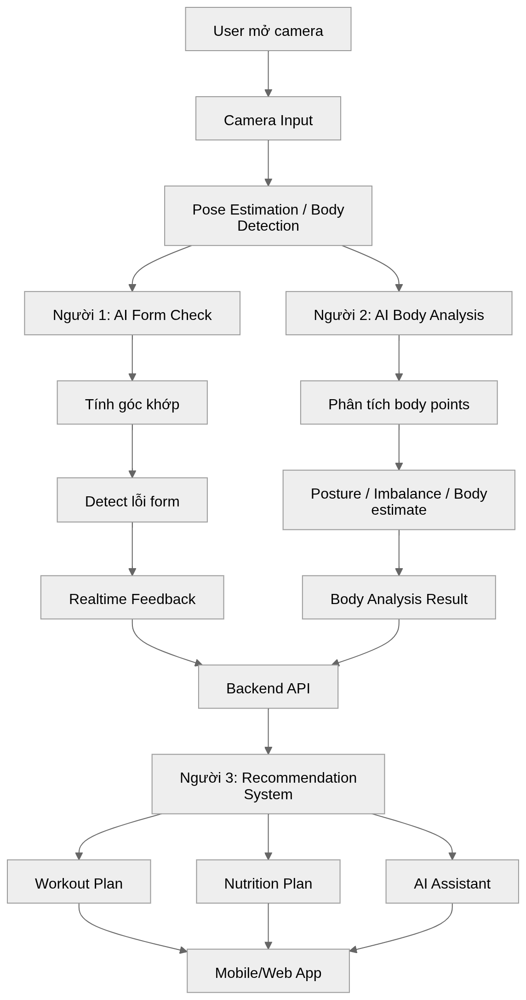

# V-Fit

# Directory Organization 
```bash 
ai-fitness-app/
├── main.py
├── requirements.txt
│
├── shared/
│   ├── pose_estimation.py
│   ├── keypoint_utils.py
│   ├── angle_calculator.py
│   ├── drawing_utils.py
│   ├── smoothing.py
│   └── constants.py
│
├── form_check/
│   ├── form_checker.py
│   ├── feedback_generator.py
│   └── rules/
│       ├── squat_rules.py
│       ├── pushup_rules.py
│       └── plank_rules.py
│
└── body_analysis/
    ├── body_analyzer.py
    ├── posture_analyzer.py
    └── imbalance_detector.py
```

# Dependencies & Installation 

# Usage

- Recommendation : 
```bash
uvicorn main:app --reload
```
