# V-FIT System Requirements Specification

**Version**: 1.0
**Date**: 2026-06-03
**Scope**: Frontend `VFIT_Fontend/` and backend `VFIT_Backend/` scan
**Audience**: Product owner, engineering, QA, deployment reviewer

## 1. Executive Summary

V-FIT is an AI-assisted fitness ecosystem composed of a Flutter mobile/web client and a Spring Boot modular-monolith API. The system supports account registration, OTP verification, email/password and social login, onboarding with body metrics/body scan, workout and exercise discovery, personalized workout recommendations, nutrition lookup and AI calorie estimation, progress photo tracking, gamification challenges, VIP payment, and admin operations.

The backend acts as the authoritative boundary for identity, authorization, onboarding completion, subscription gates, AI input validation, persistence, and audit-worthy state transitions. The frontend provides route guards, state management, camera/image workflows, and user-facing navigation.

## 2. Source Traceability

This SRS was derived from these project artifacts:

| Area | Evidence |
|---|---|
| Frontend routes | `VFIT_Fontend/lib/core/router/app_router.dart`, `app_routes.dart` |
| Frontend API contracts | `VFIT_Fontend/lib/core/constants/api_endpoints.dart` |
| Frontend dependencies | `VFIT_Fontend/pubspec.yaml` |
| Backend API controllers | `VFIT_Backend/src/main/java/com/vfit/modules/**/controller/*.java` |
| Backend security | `VFIT_Backend/src/main/java/com/vfit/security/config/SecurityConfig.java` |
| Backend WebSocket | `VFIT_Backend/src/main/java/com/vfit/infrastructure/config/WebSocketConfig.java` |
| Backend entities | `VFIT_Backend/src/main/java/com/vfit/modules/**/{document,entity}/*.java` |
| Project rules | `.specify/memory/constitution.md`, `AGENTS.md` |

## 3. Product Context

### 3.1 Goals

- Let users build and track a personalized fitness journey.
- Use AI for body analysis, form checking, nutrition estimation, and recommendation paths.
- Keep sensitive identity, payment, onboarding, and premium decisions controlled by the backend.
- Support admin visibility over users, configuration, and revenue.

### 3.2 Non-Goals

- The SRS does not redefine production deployment values or OAuth secrets.
- The SRS does not prescribe UI redesign.
- The SRS does not replace OpenAPI/Swagger contracts; it summarizes business and system requirements from code.

## 4. System Context Diagram

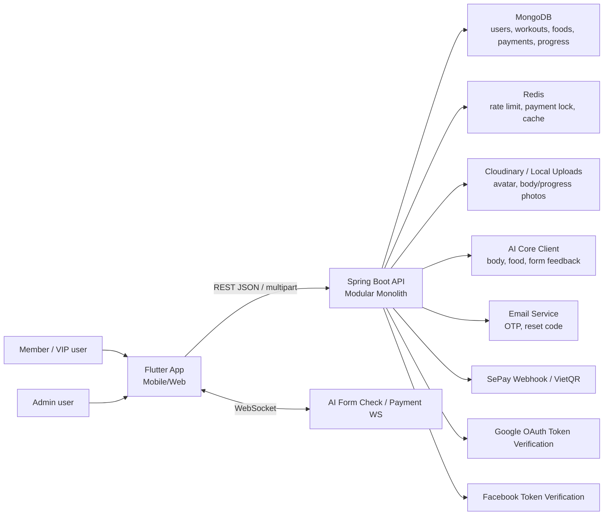

## 5. Architecture Overview

### 5.1 Frontend

| Concern | Implementation |
|---|---|
| Platform | Flutter 3.x, Dart >= 3.4 |
| Navigation | GoRouter with auth/onboarding/admin redirects |
| State | Riverpod, BLoC, notifiers |
| Network | Dio, token storage, API response/error mapping |
| Camera/media | `camera`, `image_picker`, multipart uploads |
| Social login | `google_sign_in`, `flutter_facebook_auth` |

### 5.2 Backend

| Concern | Implementation |
|---|---|
| Runtime | Java 21, Spring Boot 3.3.5 |
| Architecture | Modular monolith under `com.vfit.modules` |
| Security | Spring Security 6, JWT, stateless sessions, method security |
| Persistence | MongoDB documents |
| Cache/locks | Redis |
| Realtime | Native Spring WebSocket |
| Mapping | MapStruct |
| Observability | Actuator, structured log dependencies, explicit exception envelopes |

### 5.3 Backend Module Map

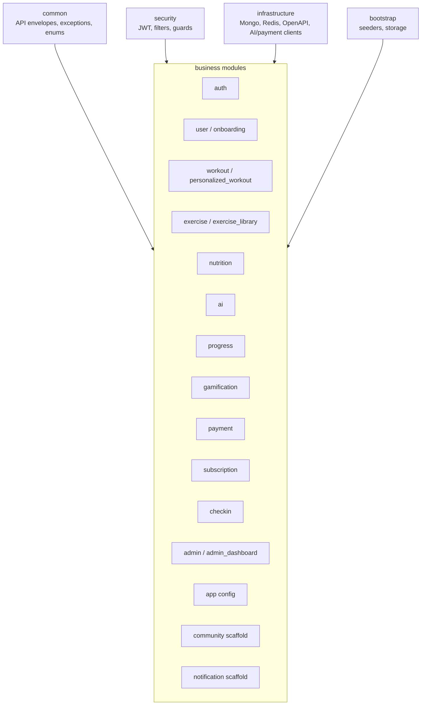

## 6. Actors

| Actor | Description | Primary permissions |
|---|---|---|
| Guest | Unauthenticated visitor | Register, login, view public catalog APIs |
| Pending user | Registered but email or onboarding incomplete | Verify OTP, complete onboarding, logout |
| Active user | Authenticated user with completed onboarding | Use core fitness, nutrition, progress, challenge, payment features |
| VIP user | Active user with active subscription | Access premium AI and gated functionality |
| Admin | User with `ADMIN` role | Admin dashboard, users, app config, revenue |
| External provider | Google/Facebook/SePay/AI/Email | Supplies verified identity, payment events, AI outputs, email delivery |

## 7. Use Case Diagram

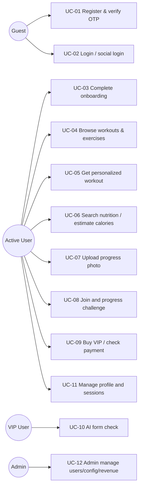

## 8. Primary Business Flows

### 8.1 Registration, OTP, and Onboarding

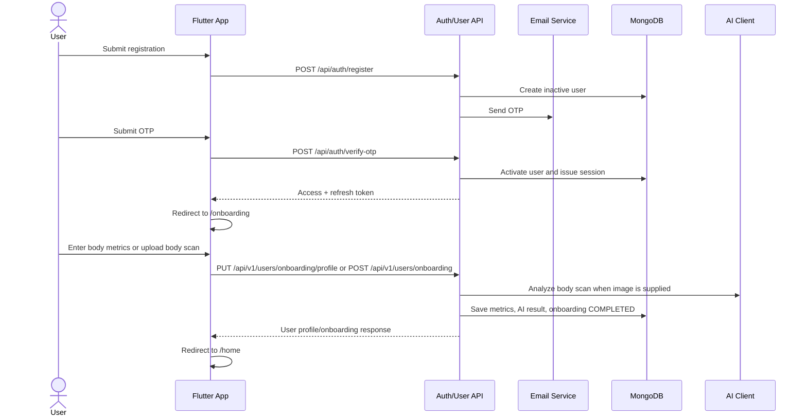

### 8.2 Authentication and Session Refresh

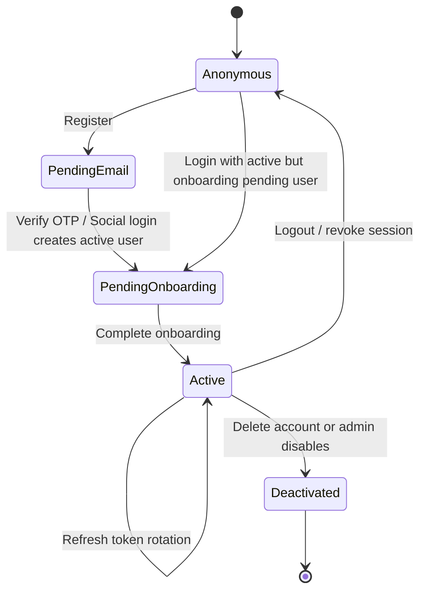

Rules:

- Email/password users must verify OTP before normal login.
- Social provider tokens must be verified server-side before account creation or linking.
- Refresh tokens are stored as SHA-256 hashes in `user_sessions`.
- Reuse of replaced refresh tokens revokes active sessions.
- Flutter route guard sends admins to `/admin/revenue`, pending users to `/onboarding`, and unauthenticated users to auth pages.

### 8.3 Workout and Exercise Discovery

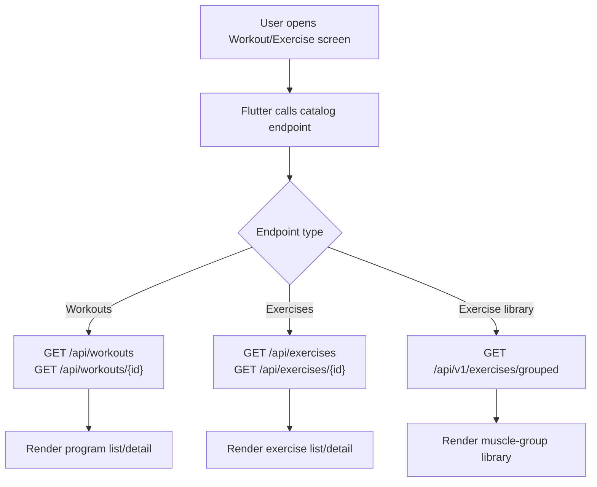

### 8.4 Personalized Workout

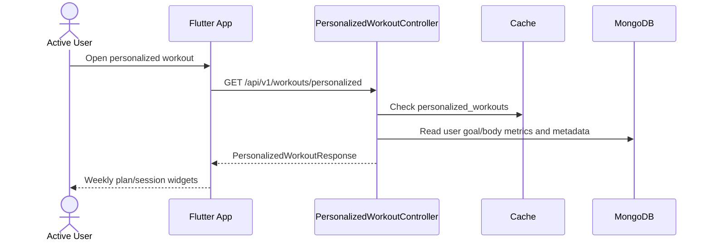

### 8.5 AI Form Check

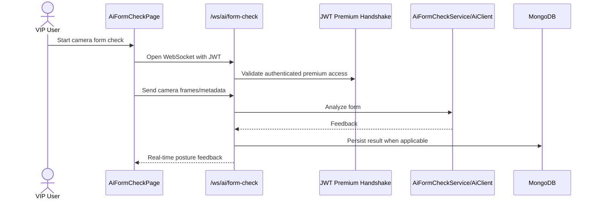

### 8.6 Nutrition Search and AI Calorie Estimate

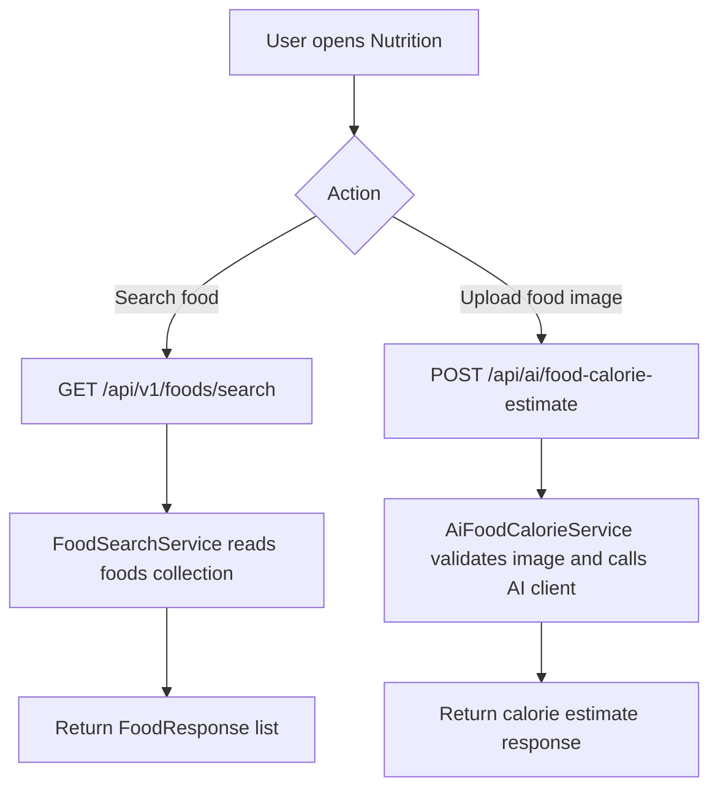

### 8.7 Progress Photo and Challenge Mapping

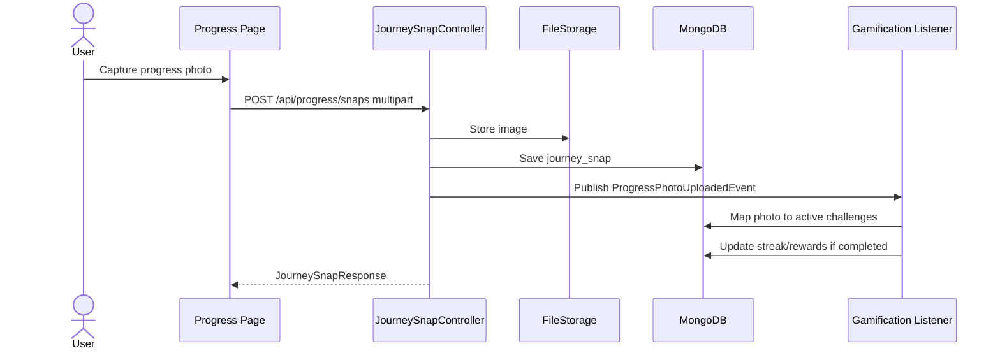

### 8.8 VIP Payment

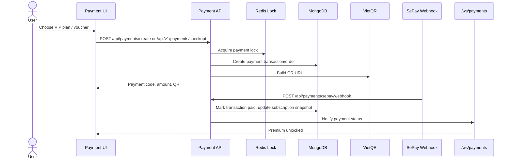

## 9. Functional Requirements

### 9.1 Authentication and Identity

| ID | Requirement | Evidence |
|---|---|---|
| AUTH-001 | The system shall support email/password registration. | `POST /api/auth/register` |
| AUTH-002 | The system shall send and verify OTP before activating normal user accounts. | `EmailOtp`, `OtpService`, `/verify-otp` |
| AUTH-003 | The system shall support Google and Facebook social login through backend token verification. | `SocialProviderVerifier`, `/social-login` |
| AUTH-004 | The system shall map social identities to one canonical V-FIT user. | `User.socialIdentities` |
| AUTH-005 | The system shall issue V-FIT JWT access tokens and refresh tokens after successful auth. | `JwtTokenProvider`, `UserSession` |
| AUTH-006 | The system shall rotate refresh tokens and detect reuse. | `AuthServiceImpl.refresh` |
| AUTH-007 | The system shall allow logout and session revocation. | `/logout`, `/api/users/sessions/{id}` |
| AUTH-008 | The system shall block deactivated accounts. | `deactivatedAt`, `/deactivated` route |

### 9.2 Onboarding and Profile

| ID | Requirement | Evidence |
|---|---|---|
| ONB-001 | Authenticated users shall complete onboarding before normal app access. | Flutter redirect, `OnboardingGuardFilter` |
| ONB-002 | Users shall submit height, weight, body fat, and goal type. | `OnboardingMetricsRequest`, `User.BodyMetrics` |
| ONB-003 | The backend shall calculate BMI when height and weight are available. | `OnboardingServiceImpl.calculateBmi` |
| ONB-004 | Users may upload body scan media for AI analysis. | `POST /api/v1/users/onboarding` |
| ONB-005 | Completed onboarding shall set `onboardingStatus=COMPLETED` and `active=true`. | `OnboardingServiceImpl` |
| PROF-001 | Users shall view and update profile information. | `GET/PUT /api/users/me` |
| PROF-002 | Users shall upload avatars. | `POST /api/users/me/avatar` |
| PROF-003 | Users shall change passwords. | `PUT /api/users/change-password` |

### 9.3 Fitness, Exercise, and Workout

| ID | Requirement | Evidence |
|---|---|---|
| FIT-001 | Users and guests shall browse public workout programs. | `GET /api/workouts` |
| FIT-002 | Users and guests shall browse public exercises. | `GET /api/exercises` |
| FIT-003 | Users shall browse grouped exercise library by muscle group. | `GET /api/v1/exercises/grouped` |
| FIT-004 | Authenticated users shall retrieve personalized workouts based on user profile. | `GET /api/v1/workouts/personalized` |

### 9.4 Nutrition and AI

| ID | Requirement | Evidence |
|---|---|---|
| NUT-001 | Users shall search food catalog entries. | `GET /api/v1/foods/search` |
| NUT-002 | Users shall request AI food calorie estimation from image input. | `POST /api/ai/food-calorie-estimate` |
| AI-001 | VIP/premium AI paths shall enforce JWT and subscription/onboarding gates. | Constitution, security filters, WebSocket handshake |
| AI-002 | AI form check shall stream feedback over WebSocket. | `/ws/ai/form-check` |

### 9.5 Progress and Gamification

| ID | Requirement | Evidence |
|---|---|---|
| PROG-001 | Users shall upload progress journey snapshots. | `POST /api/progress/snaps` |
| PROG-002 | Users shall list and delete their progress snapshots. | `GET/DELETE /api/progress/snaps` |
| GAME-001 | Users shall view badges and challenges. | `/api/gamification/badges`, `/challenges` |
| GAME-002 | Users shall join, revive, and inspect challenge participation. | Challenge participation controller |
| GAME-003 | Progress photos and workout check-ins shall advance active challenge streaks. | `ChallengeParticipationServiceImpl` |

### 9.6 Payment and Subscription

| ID | Requirement | Evidence |
|---|---|---|
| PAY-001 | Users shall create VIP payment requests and receive VietQR information. | `POST /api/payments/create` |
| PAY-002 | Users shall query payment status and VIP status. | `/api/payments/{id}/status`, `/vip-status` |
| PAY-003 | The system shall accept SePay webhook callbacks. | `/api/payments/sepay/webhook` |
| PAY-004 | Payment operations shall use Redis locks where available and Mongo atomic fallback for voucher redemption. | `PaymentServiceImpl` |
| PAY-005 | Successful payment shall update subscription documents and user subscription snapshot. | `Subscription`, `User.SubscriptionSnapshot` |

### 9.7 Admin

| ID | Requirement | Evidence |
|---|---|---|
| ADM-001 | Admin users shall access the admin dashboard only with role `ADMIN`. | `SecurityConfig`, Flutter redirect |
| ADM-002 | Admin users shall list, update role, and delete users. | `/api/admin/users` |
| ADM-003 | Admin users shall view revenue and transactions. | `/api/v1/admin/revenue/*` |
| ADM-004 | Admin users shall view and update app config. | `/api/admin/app-config` |

## 10. API Surface Summary

| Domain | Endpoints |
|---|---|
| Auth | `POST /api/auth/register`, `/resend-otp`, `/verify-otp`, `/login`, `/social-login`, `/refresh-token`, `/logout`, `/forgot-password`, `/reset-password`; `POST /api/v1/auth/refresh` |
| App config | `GET /api/app/config`, `GET /api/app/cloudinary-test` |
| User | `GET/PUT/DELETE /api/users/me`, `POST /api/users/me/avatar`, `PUT /api/users/change-password`, `GET /api/users/me/body-metrics`, session APIs |
| Onboarding | `PUT /api/v1/users/onboarding/profile`, `POST /api/v1/users/onboarding`, `PUT /api/v1/users/onboarding-metrics` |
| Workout/exercise | `GET /api/workouts`, `GET /api/workouts/{id}`, `GET /api/exercises`, `GET /api/exercises/{id}`, `GET /api/v1/exercises/grouped` |
| Nutrition/AI | `GET /api/v1/foods/search`, `POST /api/ai/food-calorie-estimate`, `WS /ws/ai/form-check` |
| Progress | `POST/GET /api/progress/snaps`, `DELETE /api/progress/snaps/{id}` |
| Gamification | `GET /api/gamification/badges`, `/challenges`, challenge join/revive/participation/checkin APIs |
| Payment | `POST /api/v1/payments/apply-voucher`, `/checkout`, `POST /api/payments/create`, `GET /api/payments/{id}/status`, `/vip-status`, `POST /api/payments/sepay/webhook`, `WS /ws/payments` |
| Admin | `/api/admin/dashboard`, `/api/admin/users`, `/api/admin/app-config`, `/api/v1/admin/revenue/monthly`, `/transactions` |

## 11. Data Model

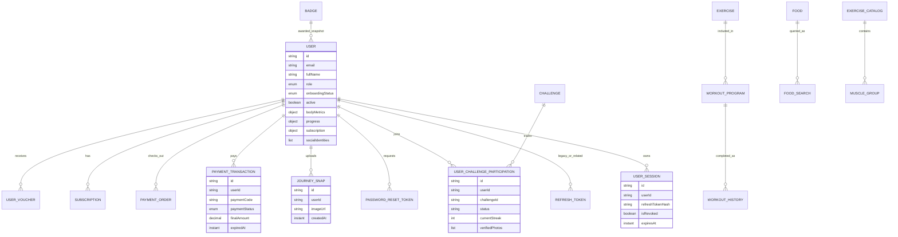

## 12. State and Guard Rules

### 12.1 Frontend Route Guard

| Condition | Destination |
|---|---|
| Auth status is initial | `/splash` |
| Authenticated admin outside admin routes | `/admin/revenue` |
| Unauthenticated user accessing protected/admin/onboarding route | `/register` |
| Authenticated user accessing auth route | `/onboarding` if pending, otherwise `/home` |
| Active user accessing onboarding | `/home` |
| Non-admin accessing admin route | `/home` |

### 12.2 Backend Access Rules

| Access type | Rule |
|---|---|
| Public auth | `/api/auth/**`, `/api/v1/auth/**` |
| Public app config | `/api/app/config` |
| Public catalog reads | GET foods, exercises, workouts, badges, challenges |
| Public webhook | `/api/payments/sepay/webhook` |
| Admin | `/api/admin/**`, `/api/v1/admin/**` require `ADMIN` |
| All other REST | Authenticated JWT required |
| AI gated paths | JWT, onboarding, premium/rate-limit filters where applicable |

## 13. Non-Functional Requirements

| Category | Requirement |
|---|---|
| Security | JWT must be stateless; refresh token values must not be persisted raw; admin APIs must require `ADMIN`; social login must be verified by backend provider verifier. |
| Privacy | AI requests must minimize and normalize user data; raw AI output must not directly alter account/payment/permission state. |
| Availability | Payment flow must tolerate Redis outage by using Mongo atomic fallback for voucher redemption. |
| Performance | Route guard and token checks should not block first paint beyond normal startup; Google/account chooser and cancel flows should reset UI promptly. |
| Observability | Backend errors should use structured API error envelopes; forbidden attempts are logged as security audit events. |
| Maintainability | Backend modules should preserve service/repository/controller boundaries and prefer events for cross-module notifications. |
| Compatibility | Frontend supports mobile and web runtime configuration through `--dart-define=API_BASE_URL`. |

## 14. Traceability Matrix

| Requirement group | Frontend modules | Backend modules |
|---|---|---|
| Auth/social login | `features/auth/**`, `social_login_client.dart`, `auth_controller.dart` | `modules.auth`, `security.jwt`, `security.config` |
| Onboarding | `features/onboarding/**` | `modules.user`, `modules.ai`, storage |
| Workout/exercise | `features/workout/**`, `features/exercise_library/**` | `modules.workout`, `modules.exercise`, `modules.exercise_library` |
| Nutrition | `features/nutrition/**` | `modules.nutrition`, `modules.ai` |
| Progress | `features/progress/**` | `modules.progress`, `modules.gamification` listener |
| Personalized workout | `features/personalized_workout/**` | `modules.personalized_workout` |
| Payment/VIP | `features/payment/**`, profile premium route | `modules.payment`, `modules.subscription`, `modules.checkin` |
| Admin | `features/admin/**`, `features/admin_dashboard/**` | `modules.admin`, `modules.admin_dashboard`, `modules.user` |

## 15. Risks and Open Items

| ID | Risk / gap | Impact | Recommendation |
|---|---|---|---|
| R-001 | Some API namespaces are mixed (`/api`, `/api/v1`). | Client/backend drift risk. | Standardize new endpoints or document versioning policy. |
| R-002 | `FEATURES.md` appears to contain mojibake text encoding. | Product docs are harder to read. | Re-save as UTF-8 and review Vietnamese labels. |
| R-003 | Some modules are scaffolded while frontend has partial UI integration. | QA may assume complete behavior. | Maintain implementation-status table per feature. |
| R-004 | Payment has mock checkout and real VietQR/SePay style paths. | Confusion in production readiness. | Separate mock/dev payment flow from production payment flow in docs and tests. |
| R-005 | Public WebSocket paths are permitted at HTTP security layer and rely on handshake interceptors. | Misconfiguration could expose realtime paths. | Keep handshake tests for JWT/premium rejection cases. |

## 16. Acceptance Checklist for SRS Review

- [ ] Product owner confirms actor/use-case list is complete.
- [ ] Engineering confirms endpoint summary against Swagger.
- [ ] QA derives test cases for auth, onboarding, payment, AI, and admin gates.
- [ ] Security reviewer validates social login, JWT, WebSocket, and payment webhook rules.
- [ ] Deployment reviewer maps required environment variables and external provider configuration in a separate deployment runbook.
